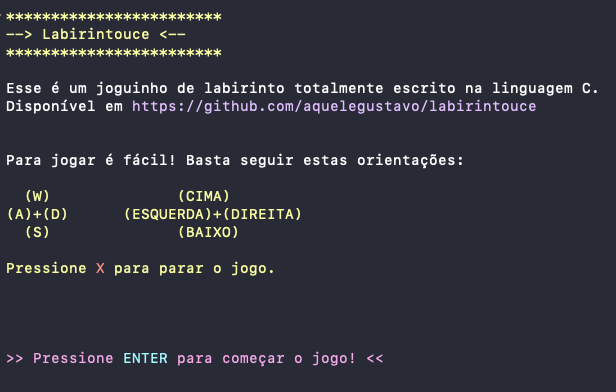
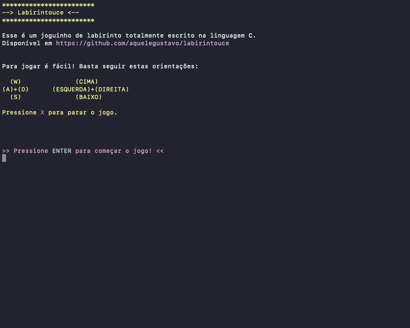

# Labirintouce: o jogo do labirinto

O joguinho de labirinto totalmente escrito na linguagem C para o trabalho de conclusão da diciplina Linguagem de Programação I da Universidade Federal de Santa Catarina (UFSC).
<br/><br/>


## O jogo

O(a) jogador(a), deve sair da posição incial e chegar até o final do labirinto tentando evitar ao máximo bater nas paredes ( \* ) e nas laterais ( | ).

Ao final do jogo, o histórico de jogadas assim como informações gerais daquela partida são adicionadas ao documento `output.txt`. Confira um [exemplo do histórico](./example.txt) gerado.

## Instalação

```sh
git clone https://github.com/aquelegustavo/labirintouce
cd labirintouce
```

## Configuração

Todas as definições globais do projeto estão alocadas em `lib/global.h`. Configure-as corretamente de acordo com sua preferência.

> Para usuários do Windows,
> altere "clear" por "cls"
> em `#define LIMPARTELA "clear"`
> dentro do arquivo `lib/global.h`

## Usando

Compile a main.c usando gcc ou seu compilador favorito

```sh
gcc lib/main.c
```

Então, execute o arquivo de saída.

```sh
../CAMINHO/ATÉ/O/ARQUIVO/main.out
```

## Demonstração

Demonstração do programa em formato gif:


## Meta

Twitter – [@AqueleGustavoLa](https://twitter.com/AqueleGustavoLa)

Distribuído sob a licença MIT. Veja `LICENSE` para mais informações.

[https://github.com/aquelegustavo](https://github.com/aquelegustavo)

## Contribuição

1. Faça o _fork_ do projeto (<https://github.com/aquelegustavo/labirintouce/fork>)
2. Crie uma _branch_ para sua modificação (`git checkout -b feature/fooBar`)
3. Faça o _commit_ (`git commit -am 'Add some fooBar'`)
4. _Push_ (`git push origin feature/fooBar`)
5. Crie um novo _Pull Request_

<br/>
<br/>
<br/>
Feito com carinho ❤️ &nbsp e muito (muito) café por Gustavo Simões e Izabelle Sebastião.
